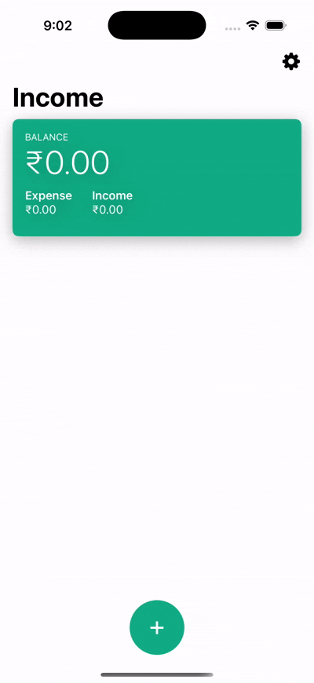

# 💰 Income - iOS Expense Tracker App

Income is a lightweight and elegant iOS application designed to help users track their daily income and expenses effortlessly. Built entirely in Swift using SwiftUI, the app features a clean interface, real-time updates, and intuitive user interactions.

---

## ✨ Features

- 📊 **Dashboard View**: Instantly see your balance, income, and expenses.
- ➕ **Quick Add**: Tap the floating "+" button to add new income/expense entries.
- 💾 **Data Persistence**: All transactions are stored locally using **Core Data**, ensuring your data remains intact even after closing or reopening the app.
- 💸 **Change Currency**: Users can change the currency symbol to match their preference or location (e.g., USD, INR, etc.).
- 🔍 **Filter Transactions**: Filter transactions by a minimum amount to focus on higher-value entries.
- 📅 **Sort Transactions**: Sort transactions by date added.
- 🔄 **Transaction Updates**: Edit or update existing transactions, ensuring that all changes are automatically saved to the local database.

---

## 🛠️ Technologies Used

- **Swift 5**
- **SwiftUI**
- **Core Data** – for efficient and persistent local storage of transactions.
- **UserDefaults** – for lightweight storage of user preferences and app settings.

---

## 🚀 Getting Started

### Requirements
- Xcode 15+
- iOS 16+
